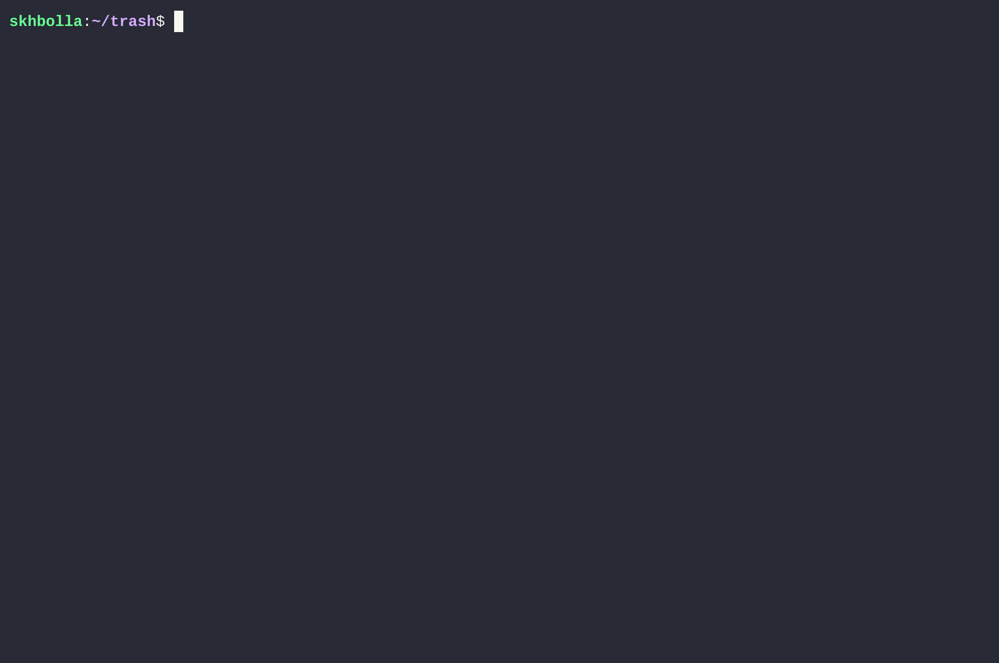

<table width="100%" border="0" cellspacing="0" cellpadding="0">
  <tr>
    <td width="50%" align="left" valign="middle" style="border: none;">
      <h1>TRaSH (TRacing SHell)</h1>
      <p><i>"The shell that explains itself"</i></p>
      <p>
        <a href="https://pubs.opengroup.org/onlinepubs/9699919799/utilities/V3_chap02.html"></a>
        <a href="#"></a>
        <a href="#"></a>
      </p>
    </td>
    <td width="50%" align="right" valign="middle" style="border: none;">
      
    </td>
  </tr>
</table>

## Demo



## What is it ?

**TRaSH** is a minimalist POSIX style shell built to trace every syscall,
hex-dump every buffer, and visualize exactly how Unix works under the hood.
This project implements the core mechanics of a command-line interface,
including process creation via fork/exec, pipeline management with pipe,
history persistence and autocompletion. Designed as a deep-dive into how
the kernel manages user-space execution environments.

## Why I built it ?

The main purpose of this project was for **me** to understand how a shell actually
works. To do that, I decided to dive head-first into building one from scratch
in C, effectively learning C fundamentals and Linux internals at the same time.

## The "Trace" Philosophy

The **TR** in TRaSH is the most important part. As I build each feature,
I include detailed trace messages that show exactly what’s happening
under the hood. When I type a command, TRaSH tells me:

* How the input was tokenized.

* Which syscalls (like `fork`, `execv`, or `pipe` etc.) are being fired.

* How file descriptors are being shuffled around during redirection.

* etc.

In other words, **TRaSH is a shell that explains it's every action**

## Roadmap & Progress

I’m building this incrementally, moving from a simple REPL to an educational tool.

- [x] Basic REPL (Read-Eval-Print Loop)

- [x] Builtin commands: `echo`, `exit`, `type`

- [x] Locating local binaries via `PATH`

- [x] Executing non-builtins by spawning child processes (`fork` & `execv`)

- [x] Basic navigation: `cd` (relative/absolute) and `pwd` builtins

- [x] Handling quotes (single and double)

- [x] Primitive redirection: `>` and `>>`

- [ ] Pipelines (primitive, non-complex)

- [ ] Background jobs (`&`)

- [ ] Command history and persistence

- [ ] Command auto-completion

- [ ] Filename auto-completion

## How to Build

```bash
# Clone the repo
git clone https://github.com/skhbolla/trash.git

# Build using the provided Makefile
make

# Run the shell
./trash
```

## References I used

* [IEEE 1003.1 standard](https://pubs.opengroup.org/onlinepubs/9699919799/utilities/V3_chap02.html)
* [Beej's Guide to Interprocess Communication](https://beej.us/guide/bgipc/)
